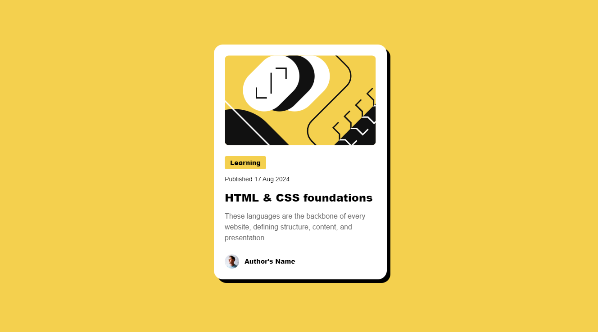

# QR code component solution

This is a solution to the [QR code component challenge on Frontend Mentor](https://www.frontendmentor.io/challenges/blog-preview-card-ckPaj01IcS). 

## Table of contents

- [Overview](#overview)
  - [Screenshot](#screenshot)
  - [Links](#links)
- [My process](#my-process)
  - [Built with](#built-with)
  - [What I learned](#what-i-learned)
  - [Continued development](#continued-development)
- [Author](#author)

**Note: Delete this note and update the table of contents based on what sections you keep.**

## Overview

### Screenshot



### Links

- Solution URL: [Github Repo](https://github.com/franArteaga8/fM--000-blog-preview-card)

## My process

### Built with

- Semantic HTML5 markup
- CSS custom properties
- Flexbox
- Mobile-first workflow

### What I learned

Learned to use clamp to achieve responsiveness without media queries.

```css
.proud-of-this-css {
  width: clamp(327px, 15vw + 15rem, 384px);
 
  aspect-ratio: 1/1;
  width: 32px;
}
```

### Continued development

I still wanna improve my handling of responsive sizes.

## Author

- Github - [franArteaga8](https://github.com/franArteaga8)
- Frontend Mentor - [@franArteaga8](https://www.frontendmentor.io/profile/franArteaga8)
